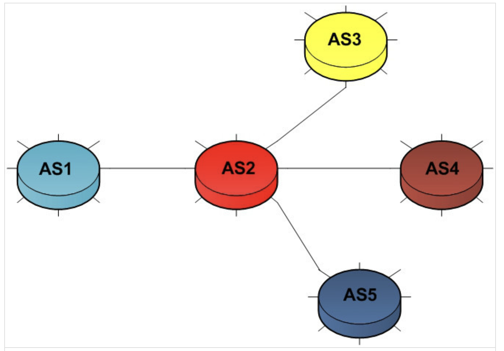
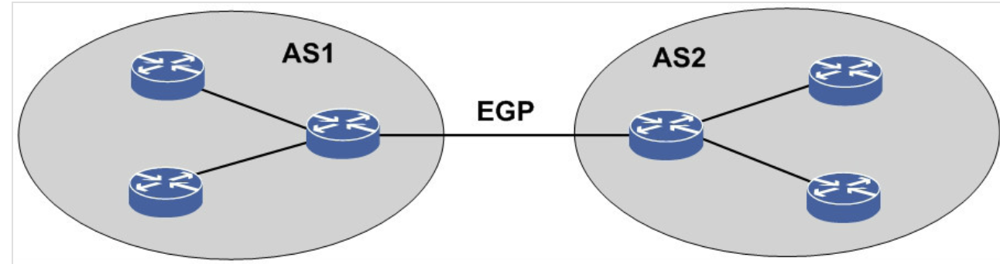
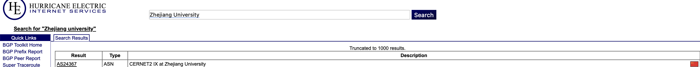
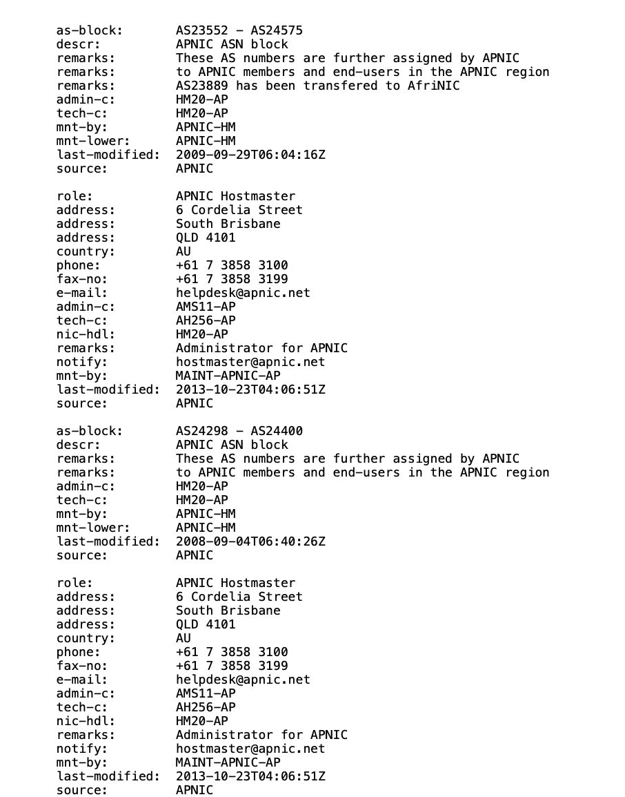
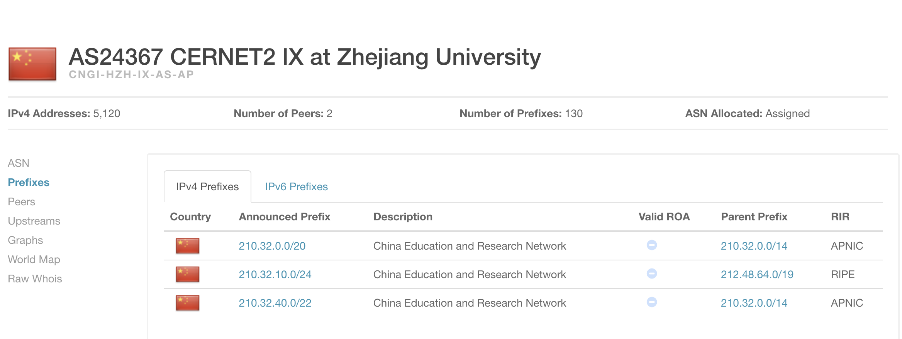
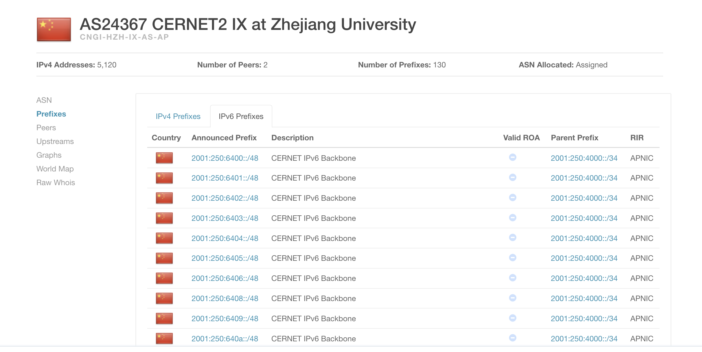

## 1. 什么是自治系统，自治系统分为几种类别，它们的作用是什么
- 什么是自治系统  
自治系统(autonomous system)是一个或多个网络运营商代表单个管理实体或域的控制下，连接的internet协议IP路由前缀的集合，它向internet提供了一个通用且明确定义的路由策略
或者说，AS是在单一技术管理体系下又唯一自治系统号标识的多个路由器的集合，是具有（同种或多种）路由协议策略的巨型网络或网络群组
通常情况下，每个AS由单个大型组织运营（例如大学或政府机构）
- 自治系统类别  
    - 多出口的自治系统（multihomed）  
    是指与其他的自治系统具有多于一个连接的自治系统，具有高稳定性，如果连接中的某一个完全失效，这个多出口的自治系统也依然能保持和互联网络的联系
    

    - 末端自治系统  
    是指仅与一个其他自治系统相连的自治系统
    

    - 中转自治系统  
    是指一个自治系统通过自己来为几个隔离开的网络提供联通服务  
    也就是说，网络A可通过中转AS的网络B来连接到网络C

## 2. 浙江大学（紫金港校区）所在的自治系统编号，它是由哪个机构进行管理的？所包含的IP段又有哪些
- 访问bgp.he.net来查询浙江大学所在的自治系统编号(asn)

查询可得ASN为AS24367

- 管理机构  

查询可得管理机构为APNIC(亚太网络信息中心)  

- 使用BGP路由数据库(BGPView)来查询包含的IP段
    - IPv4
    
    查询可知包含了210.32.0.0/20, 210.32.10.0/19, 210.32.40.0/22这三个IPv4段
    - IPv6
    
    包含的IPv6段如上图所示

## 3. mtr工具学习
#### 使用mtr工具展示从校园内部出发访问Github服务器所经过的自治系统路径
- 创建ubuntu容器  
由于mtr工具是在linux系统上的应用，因此我们先在本地拉取ubuntu镜像
```bash
docker pull ubuntu

///启动容器并进入Ubuntu
docker run -ir ubuntu bash

```
- 更新包列表并安装mtr  
```bash
apt-get update
apt-get install mtr -y
```
- 运行mtr
```bash
///使用aslookup来查询经过的自治系统
mtr --report --aslookup github.com
```

#### a. mtr工具实现的核心是数据包的哪一个字段。据此，mtr的工作原理是什么
mtr工具又称Multi-Threaded Routing Toolkit, 是一个网络诊断工具，通过发送和接收一系列的ICMP数据包来评估网络中的路径延迟、丢包率和网络带宽等信息。
mtr在发送ICMP数据包给目标主机时，会利用数据包中的TTL(Time to Live)字段，它用来表示数据包可以经过的最大跳数。数据包中的TTL字段没经过一个路由器数量就-1，当TTL变为0，路由器丢弃该数据包，并返回ICMP Time Exceeded消息，mtr通过分析这些ICMP Time Exceeded响应，来确定数据包经过的路由器
#### b. 其中你可能会发现有一些自治系统编号未显示，还有一些节点甚至许久没有反应，出现 这种现象的可能原因有哪些?
- 路由器的ICMP响应策略  
因为mtr工具的策略是通过TTL字段的ICMP超时响应机制，而有的路由器可能限制ICMP超时响应
- 由于权限原因有的路由器不公开AS信息  
也就是说即使使用whois来直接查询数据库也无法获得ASN信息，那么通过mtr来查询也当然无法获取
- 数据包丢包
- 某些路由器通过防火墙拦截了mtr发送到ICMP数据包

## 4. 自治系统是如何互相交换数据包的？它们之间需要建立什么样的关系？这样的关系又分为哪些？
- 自治系统内部之间互相交换数据包  
内部网关协议(IGP)
- 自治系统之间互相交换数据包  
外部网关协议(EGP),典型的外部网关协议是BGP(边界网关协议)


