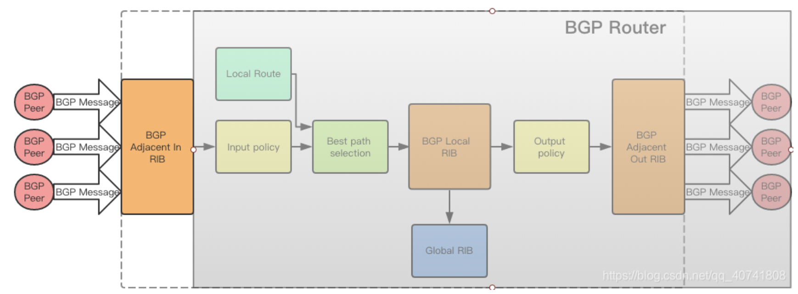

## 1. BGP 分为哪两种运行方式
- 1. EBGP（external BGP， 外部BGP）  
运行在不同的自治系统AS之间
- 2. IBGP（Internal BGP， 内部BGP ）  
运行在同一个自治系统AS之间
## 2. BGP 报文又分为哪几种?分别有什么作用?它们又有哪些组成部分?
- 1. OPEN（打开报文）
作用是建立BGP邻居关系，进行处事能力协商，组成部分如下
    - Marker
    - Length
    - Type
    - Version
    - BGP Identifier(BGP标识符)
- 2. UPDATE(更新报文)  
作用是用于通告新的路由信息或撤销失效的路由，组成部分如下
    - Withdrawn Routes（撤销路由）
    - Total Path Attribute（路径属性总长度）
    - Path Attributes（路径属性）
    - NLRI（网络层可达性信息）
- 3. KEEPALIVE（保持报文）
作用是维持BGP邻居关系，防止回话超时，组成部分如下
    - 只有固定19字节（BGP头部），无额外数据

- 4. NOTIFICATION（通知报文）
用于通知BGP错误，并终止BGP邻居关系
    - Error Code（错误代码）
    - Error Subcode(错误字代码)
    - Data(数据部分)

## 3. BGP又是如何处理路由的？在选择AS路径时又有哪些评判标准？
#### 处理路由的过程

- 建立BGP邻居（BGP Peer）
    - 通过TCP端口179建立连接，并进行能力协商
- BGP Adjacent in RIB  
这一步把所有的BGP Message都存到了BGP Adjacent in RIB
- Input policy  
    - filtering  
    filtering会根据Path Attribute过滤BGP message  
    manipulation会修改BGP Message的Path Attribute，从而方便后面的步骤
- Best path selection  
Best Path Selection是一个根据Path Attribute运算，从指向同一个目的IP prefix的，多条BGP Message中选出一条最优的过程  
- BGP Local RIB  
经过Best Path Selection后获取的BGP Messge会保存到BGP Local RIB中
    - 写入到Global RIB，也就是全局路由表
    - 输出到Output Policy, 进而发往其他的BGP Peer
- BGP Adjacent out RIB
将生成好的BGP Message发往对端的BGP Peer
#### 选择AS路径的标准
- 优选本地优先级（local_pref）最高的路由
- 优选AS_path最短的路由（AS_path是一个包含路由经过的所有自治系统AS的列表，AS_path越短表示路径越少）
- Multi-Exit Discriminator(MED),用于在不同自治系统之间的选择优先级，数值越小优先级越高